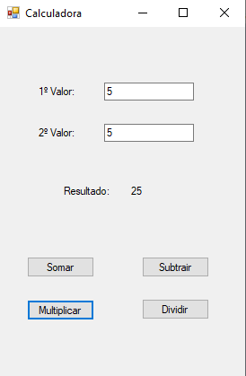
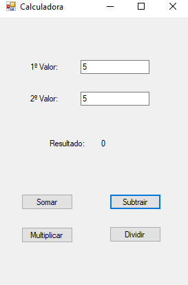
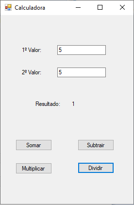

# calculadora_metodos-CSharp
feito no visual studio. aula para aprender métodos e classes no C#. Aula na Etec de Guarulhos.
  

  <h3>Calculadora com os campos para preencher e o resultado da Soma escrito no campo do label</h3>
   

  

  <h3>Resultado da Multiplicação escrito no campo do label e o Resultado da Subtração escrito no campo do label</h3>
   

  

  <h3>Resultado da Divisão escrito no campo do label</h3>
  

